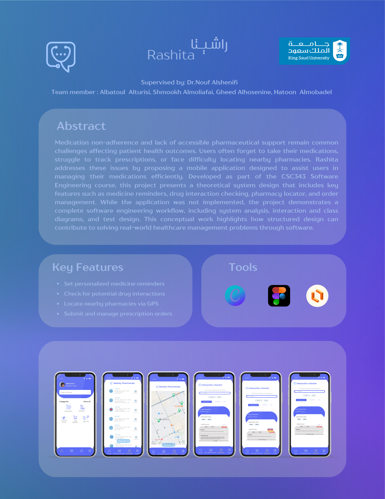
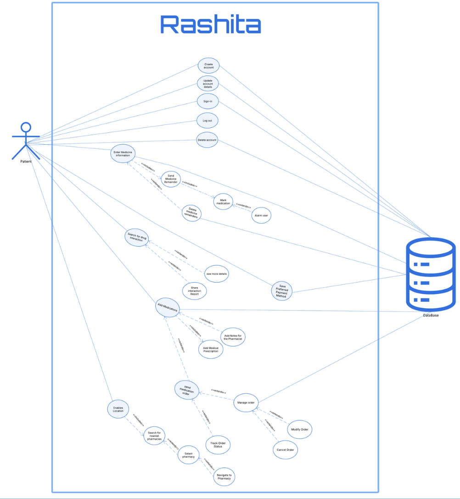
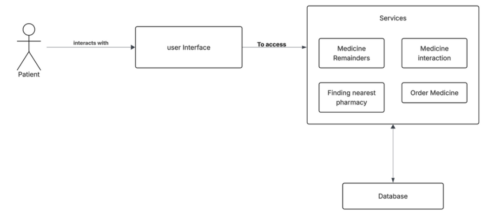
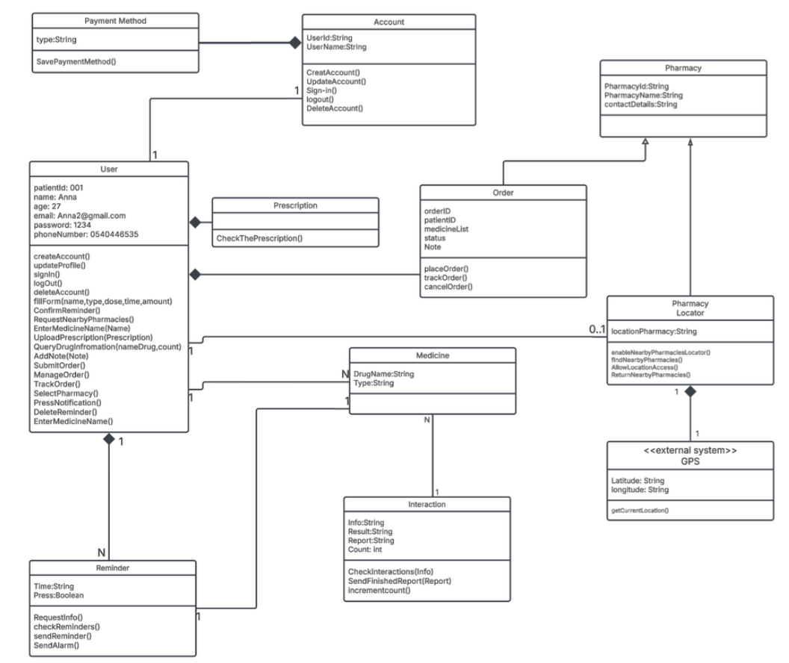
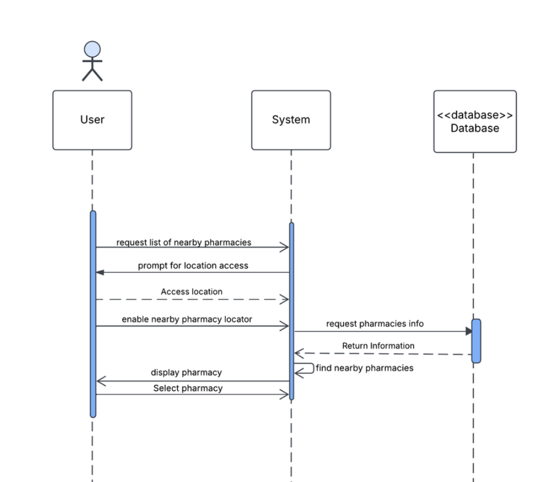
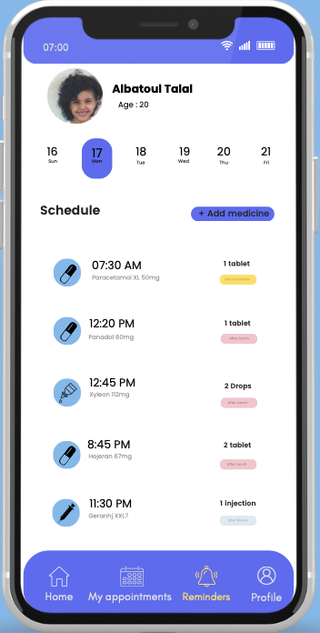
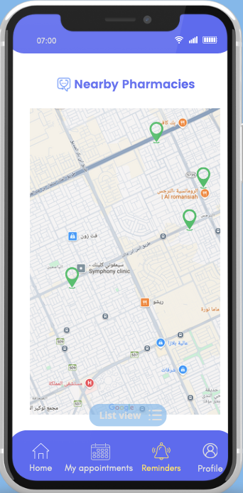
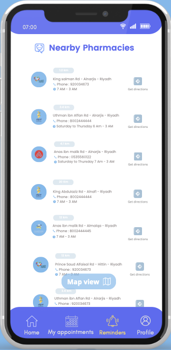

# Rashita
### Medication Management System

<p align="center">
  
</p>

## Overview

**Rashita** is a medication management system designed as part of the **CSC343 Software Engineering** course at King Saud University.

The project was primarily focused on **software requirements engineering, system analysis, and software design**, rather than full application implementation. A major part of the work involved identifying, analyzing, and documenting system requirements and translating them into structured software models.

The proposed system aims to support users in managing their medications through features such as medication reminders, drug interaction checking, nearby pharmacy location, and medicine order management.

The project covers the software engineering process from requirements analysis and use case modeling to system architecture, UML modeling, test design, and user interface prototyping.

> **Note:** Rashita is primarily a software analysis and design project. The user interfaces were developed as prototypes to visualize the proposed system rather than as a fully implemented mobile application.

---

## Project Objectives

- Analyze the requirements of a medication management system
- Define functional and non-functional system requirements
- Identify system actors and their interactions
- Develop detailed use cases
- Translate requirements into UML and interaction models
- Design the proposed system architecture
- Design testing scenarios for the main system services
- Develop UI prototypes to visualize the proposed system

---

## Key Features

The proposed Rashita system includes:

- **Medication Reminders**  
  Allows users to manage medication schedules and receive reminders.

- **Drug Interaction Checker**  
  Allows users to check potential interactions between medications.

- **Nearby Pharmacy Locator**  
  Uses location information to help users find nearby pharmacies.

- **Medicine Ordering**  
  Supports medicine ordering and prescription-related processes.

- **Order Management**  
  Allows users to manage and track medicine orders.

- **Account Management**  
  Supports account creation, profile updates, sign-in, logout, and account management.

---

## Requirements Analysis

A significant portion of the project was dedicated to **requirements engineering and analysis**.

Rather than focusing primarily on application development, the project emphasized understanding the problem domain, determining what the proposed system should provide, documenting these requirements, and translating them into structured software designs.

The requirements analysis included:

- Stakeholder and actor identification
- Customer requirements
- Functional requirements
- Non-functional requirements
- Use case identification
- Detailed use case specifications
- System behavior analysis
- Interaction analysis
- Requirements-based system modeling

The analyzed requirements served as the foundation for the system architecture, UML diagrams, interaction models, and testing scenarios developed throughout the project.

---

## Use Case Model

The Use Case Diagram represents the major interactions between the patient and the proposed Rashita system.

It covers account management, medication reminders, drug interaction checking, medicine ordering, order management, and nearby pharmacy location.

<p align="center">
  
</p>

---

## System Architecture

Following the requirements analysis, a high-level architecture was designed to represent how the main components of Rashita interact.

The proposed architecture separates the **User Interface**, core system **Services**, and **Database**.

The main services include:

- Medicine Reminders
- Medicine Interaction
- Finding Nearest Pharmacy
- Order Medicine

<p align="center">
  
</p>

---

## System Design

The analyzed requirements were translated into UML and interaction models to represent the structure and behavior of the proposed system.

### Class Diagram

The Class Diagram represents the major system entities, their attributes, operations, and relationships.

It includes components related to users, accounts, medicines, reminders, prescriptions, orders, pharmacies, pharmacy location, GPS, payment methods, and medicine interactions.

<p align="center">
  
</p>

### Sequence Diagram

Sequence diagrams were developed to represent how different components interact when performing system functions.

The example below represents the process of finding nearby pharmacies and shows the interaction between the **User**, **System**, and **Database**.

<p align="center">
  
</p>

Additional interaction models were developed during the project for other system functions.

---

## Software Engineering Models

Multiple software engineering models were developed throughout the project to represent the system from different perspectives.

These included:

- Use Case Diagram
- Detailed Use Cases
- System Sequence Diagrams
- Sequence Diagrams
- Class Diagram
- Object Diagram
- State Diagram
- Collaboration Diagram
- Architectural Diagram

Together, these models describe user interactions, system behavior, object relationships, and the overall structure of the proposed system.

---

## Testing

Testing was considered during the design stage to ensure that the documented requirements could be translated into testable system behavior.

Test scenarios were designed for the main system services, including:

- Nearby Pharmacy Locator
- Medication Reminder System
- Drug Interaction Checker
- Medicine Ordering
- Order Management

The project included both **Unit Testing** and **Integration Testing** designs.

### Unit Testing

Unit testing scenarios focused on individual functions and services, including:

- Retrieving the user's location
- Triggering medication reminders
- Managing active orders
- Checking drug interactions
- Processing medicine orders

### Integration Testing

Integration testing scenarios focused on interactions between system components, including:

- Location services and pharmacy information
- Medication schedules and reminders
- Orders and stored user information
- Drug interaction checking and reports
- Prescription processing and order management

---

## UI Prototype

User interfaces were designed to visualize how the analyzed requirements could be represented in a mobile application.

The UI prototype was a **supporting part of the project rather than its primary focus**. Its purpose was to demonstrate selected system functions and visualize the proposed user experience.

### Medication Schedule

The medication schedule interface allows users to view scheduled medicines, medication information, and reminder times.

<p align="center">
  
</p>

### Nearby Pharmacies — Map View

The map interface visualizes nearby pharmacies based on the user's location.

<p align="center">
  
</p>

### Nearby Pharmacies — List View

The list interface provides nearby pharmacy information in a structured view.

<p align="center">
  
</p>

---

## My Contribution

As part of the project team, I contributed to multiple stages of the software engineering analysis and design process.

My contributions included:

- Participating in writing the project report
- Contributing to the **Use Case Diagram**
- Working on selected functional requirements
- Working on selected non-functional requirements
- Designing selected user interfaces
- Developing **System Sequence Diagrams**
- Developing **Sequence Diagrams**
- Contributing to the **Class Diagram**
- Creating the **Object Diagram**
- Creating the **State Diagram**

My contribution therefore covered both **requirements analysis and system modeling**, with additional work on the user interface prototype.

---

## Tools

Tools and modeling techniques used during the project included:

- Visual Paradigm
- Figma
- Canva
- UML

---

## Team

**CSC343 — Software Engineering**

- Albatoul Alturisi
- Shmookh Almoliafai
- Gheed Alhosenine
- Hatoon Almobadel

**Supervised by:** Dr. Nouf Alshenifi  
**King Saud University**

---

## Project Type

Software Engineering Course Project  
CSC343 — Software Engineering  
King Saud University

---

## Repository Structure

```text
assets/
├── cover-page.png
├── architecture.png
├── use-case-diagram.png
├── class-diagram.png
├── sequence-diagram.png
├── ui-home.png
├── ui-map.png
└── ui-pharmacies.png
```

---

## About This Repository

This repository serves as a portfolio showcase of the **Rashita Software Engineering project**.

The repository presents selected requirements, UML models, system architecture, interaction diagrams, testing work, and UI prototypes to demonstrate the project's software engineering methodology.

The project was primarily centered on **requirements analysis and system design**, while the interfaces were developed as prototypes to demonstrate how the analyzed requirements could be represented in a mobile application.
